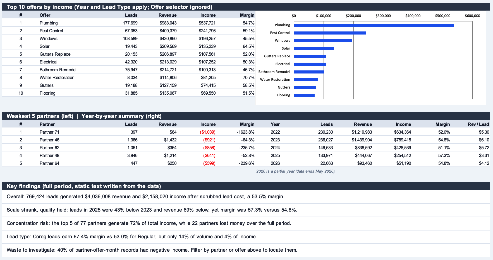

<div align="center">

# Lead Performance Dashboard

### An Interactive Excel Dashboard for a Lead Buying and Selling Business


**Filter by `Year` · `Lead Type` · `Offer` and every KPI, ranking and chart updates**

</div>

---

## Overview

This project turns a flat monthly extract of lead sales into a one-page Excel dashboard
that answers the questions a lead-buying and lead-selling business asks every month:
which partners and offers make money, how volume and margin have changed, and where
money is being lost.

The business buys leads from partners, scrubs out the rejected ones, and sells the rest
to buyers. The source data has one row per partner, offer and month, which is hard to
read without a way to slice it. The dashboard adds three dropdown selectors and
formula-driven rankings so a reader can explore 53 months of history in seconds.




## Key Result

> Across 53 months, **769,424 leads** produced **$4.04M revenue** and **$2.16M income**
> after scrubbed lead cost, a **53.5% margin**. Volume fell sharply after 2023, but
> margin held up and even improved, while income depends heavily on a few partners.

| Metric | Value |
|---|---|
| Total leads | 769,424 |
| Total revenue | $4,036,008 |
| Net cost (after scrub) | $1,877,988 |
| Income | $2,158,020 |
| Margin | 53.5% |
| Income per lead | $2.80 |

**Year by year** (2026 covers January to May only):

| Year | Leads | Revenue | Income | Margin | Revenue per lead |
|---|---|---|---|---|---|
| 2022 | 230,230 | $1,219,983 | $634,364 | 52.0% | $5.30 |
| 2023 | 236,027 | $1,439,904 | $789,415 | 54.8% | $6.10 |
| 2024 | 146,533 | $838,592 | $428,539 | 51.1% | $5.72 |
| 2025 | 133,971 | $444,067 | $254,512 | 57.3% | $3.31 |
| 2026 (partial) | 22,663 | $93,460 | $51,190 | 54.8% | $4.12 |

## Main Findings

1. **Scale shrank, quality held.** Leads in 2025 were 43% below 2023 and revenue was
   69% below, yet margin rose from 54.8% to 57.3%.
2. **Income is concentrated.** The top 5 of 77 partners generate 72% of total income,
   and 22 partners lost money over the full period.
3. **Coreg leads are more profitable per dollar of revenue.** They earn a 67.4% margin
   versus 53.0% for Regular leads, but make up only 14% of volume and 4% of income.
4. **The biggest offers are not the best margins.** Plumbing is the largest income
   source ($537,721 at a 54.7% margin), while Windows has high volume (108,589 leads)
   but a lower 45.5% margin.
5. **Losses are widespread at record level.** About 40% of partner-offer-month records
   had negative income, which is where to look for waste.

## Dashboard Components

| # | Component | What it shows | How it works |
|---|---|---|---|
| 1 | **Selectors** | Year, Lead Type, Offer | Dropdowns with data validation; "All" uses wildcard criteria |
| 2 | **KPI cards** | Leads, revenue, net cost, income, margin, income per lead | `SUMIFS` over the data with all three selectors |
| 3 | **Monthly trend** | Revenue, net cost and income for every month | Combined column and line chart; ignores the Year selector |
| 4 | **Top 10 partners** | Leads, revenue, income, margin plus a bar chart | `LARGE` + `INDEX` + `MATCH` with a tie-breaker |
| 5 | **Top 10 offers** | Same fields for offers | Same ranking method; ignores the Offer selector |
| 6 | **Weakest 5 partners** | Loss-makers under the current filters | `SMALL` + `INDEX` + `MATCH` |
| 7 | **Year-by-year table** | Leads, revenue, income, margin, revenue per lead | `SUMIFS` by year; ignores the Year selector |
| 8 | **Key findings** | Written insights for the full period | Static text |

## Excel Skills Shown

| Skill | Where it is used |
|---|---|
| `SUMIFS` with several dynamic criteria | Every KPI, ranking and table |
| Wildcard "All" option | Lead Type and Offer filters |
| Data validation dropdowns | Year, Lead Type, Offer |
| Dynamic top-N and bottom-N ranking | `LARGE`, `SMALL`, `INDEX`, `MATCH` |
| Combined and bar charts | Trend chart and ranking charts |
| Structured Excel Table | Source data (`tblLeads`) |
| Data cleaning and documentation | Notes sheet |
| Dashboard layout | KPI cards, consistent colours, print setup |

## Dataset

| Field | Description |
|---|---|
| Month | First day of the reporting month |
| Year | Calendar year |
| Lead Type | `Regular` or `Coreg` |
| Partner | Lead supplier, anonymised as Partner 01 to Partner 77 |
| Offer | Product or service the lead is for (40 offers plus "Unknown") |
| Leads | Number of leads |
| Gross Cost | Lead cost before scrubbing |
| Net Cost | Lead cost after rejected leads are scrubbed |
| Revenue | Revenue from selling the leads |
| Income | Revenue minus Net Cost |

| Property | Value |
|---|---|
| Records | 9,796 |
| Period | January 2022 to May 2026 (53 months) |
| Partners | 77 |
| Lead types | 2 |

**Data preparation:** one record with a blank revenue was rebuilt as auto revenue plus
agent revenue (this identity held on every other row). One blank offer was labelled
"Unknown". Unused columns and a stray helper formula were removed. Income equals
revenue minus net cost on 100% of source rows, so it is calculated by formula.

## Repository Structure

```
.
├── Lead_Performance_Dashboard.xlsx    # The workbook
├── Asset/
│   └── Banner_image/                  # Banner used in this README
├── images/                            # Dashboard screenshots used in this README
│   ├── dashboard.png
│   └── dashboard-2.png
└── README.md
```

**Inside the workbook:**

| Sheet | Purpose |
|---|---|
| Dashboard | The interactive report |
| Notes | Method, assumptions and data preparation |
| Data | Cleaned records as an Excel Table |
| Calc | Helper tables behind the dashboard |
| Lists | Dropdown values |

## Getting Started

**1. Clone the repository**

```bash
git clone https://github.com/sanjibSamadder/lead-performance-dashboard-excel.git
cd lead-performance-dashboard-excel
```

**2. Open the workbook** in Excel 2010 or later. No macros or add-ins are needed.

**3. Use the yellow cells** at the top of the **Dashboard** sheet to pick a Year,
Lead Type or Offer. Everything recalculates automatically.

The Year filter applies to the KPIs, partner ranking and offer ranking. The trend chart
and the year-by-year table always show every year so the full history stays visible.

## Limitations

- **The selectors are formula-driven**, not PivotTable slicers.
- **The key findings text is static.** It describes the full period and does not change
  with the filters.
- **Income is contribution margin.** Overheads are not in the data, so they are not
  deducted. Currency is assumed to be USD.
- **2026 is a partial year** (data ends May 2026), so year comparisons with 2026 are
  not like for like.
- **The workbook was built programmatically and recalculated outside Excel.** Chart
  styling may look slightly different in Excel.

## Provenance & License

**Source:** a monthly extract from a lead-buying and lead-selling business, taken from
the author's past work. Partner names were replaced with Partner 01 to Partner 77 to
protect confidentiality.

**License:** not yet specified. Add a licence file before inviting reuse of the data.

## Future Work

- [ ] Add PivotTables and slicers as an alternative view
- [ ] Add a partner scorecard with a margin threshold and flags
- [ ] Add a rejection-rate view (gross cost versus net cost by partner)
- [ ] Add month-over-month and year-over-year change indicators
- [ ] Rebuild the same dashboard in Power BI for comparison

## Author

**Sanjib Samadder**

**📬 Let's connect!** I'm open to discussions about data analytics, dashboards, and collaborative projects.

[](mailto:skilled.sanjib@gmail.com)
[](https://github.com/sanjibSamadder)
[](https://linkedin.com/in/sanjib-samadder)

**Happy Analyzing!** 📊

## Disclaimer

This project is for educational and portfolio purposes only. The figures describe one
business's historical data and are not financial advice.
