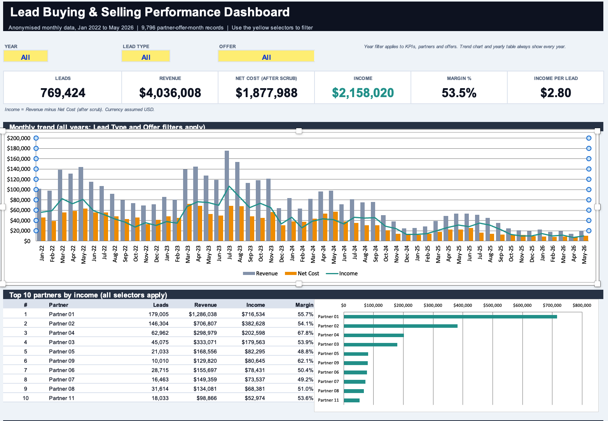

# Lead Performance Dashboard (Excel)

An interactive Excel dashboard that shows how a lead-buying and lead-selling business performed across partners, offers and lead types, from January 2022 to May 2026.

## The problem

The business buys leads from partners and sells them on. Leadership needed to answer a few questions quickly:

- Which partners and offers actually make money?
- How have volume, revenue and margin changed over time?
- Where is money being lost?

The source data was a flat monthly extract with one row per partner, offer and month. That is hard to read without a way to slice it.

## What I built

A single-sheet dashboard driven by three dropdown selectors (Year, Lead Type, Offer). Every number, ranking and chart recalculates when a selector changes.

- **6 KPI cards:** leads, revenue, net cost, income, margin %, income per lead
- **Monthly trend chart:** revenue, net cost and income for all 53 months
- **Top 10 partners and top 10 offers** by income, each with a bar chart
- **Weakest 5 partners,** to spot loss-makers
- **Year-by-year summary table**
- **Key findings** written from the data

## Excel skills shown

- `SUMIFS` across ~10,000 rows with multiple dynamic criteria, including an "All" option using wildcards
- Dropdown controls with data validation
- Dynamic top-N and bottom-N rankings using `LARGE`, `SMALL`, `INDEX` and `MATCH`, with a tie-breaker so equal values never collide
- Combined column and line chart, plus ranked bar charts
- Structured Excel Table for the source data
- Data cleaning, anonymisation and documented assumptions
- Dashboard layout: KPI cards, consistent colours, print setup

## Key findings

| Finding | Number |
|---|---|
| Total leads | 769,424 |
| Total revenue | $4,036,008 |
| Income after scrubbed lead cost | $2,158,020 |
| Overall margin | 53.5% |
| Income per lead | $2.80 |

- **Scale shrank, quality held.** Leads in 2025 were 43% below 2023 and revenue was 69% below, yet margin rose from 54.8% to 57.3%.
- **Concentration risk.** The top 5 of 77 partners generate 72% of total income, and 22 partners lost money over the full period.
- **Coreg leads are more profitable per dollar.** They earn a 67.4% margin versus 53.0% for regular leads, but make up only 14% of volume and 4% of income.
- **A lot of waste to investigate.** About 40% of partner-offer-month records had negative income.

## How to use it

1. Download `Lead_Performance_Dashboard.xlsx` and open it in Excel (2010 or later; no macros or add-ins).
2. Use the yellow cells at the top of the **Dashboard** sheet to pick a Year, Lead Type or Offer.
3. Read the **Notes** sheet for the method and data cleaning steps.

The year filter applies to the KPIs, partner ranking and offer ranking. The trend chart and the year-by-year table always show every year so the full history stays visible.

## Workbook structure

| Sheet | Purpose |
|---|---|
| Dashboard | The interactive report |
| Notes | Method, assumptions and data preparation |
| Data | Cleaned records (9,796 rows) as an Excel Table |
| Calc | Helper tables behind the dashboard |
| Lists | Dropdown values |

## Data and assumptions

- The data comes from a real business and has been **anonymised**: partner names were replaced with Partner 01 to Partner 77, ranked by total revenue.
- **Income = Revenue minus Net Cost.** "Net Cost" is the source's scrub cost, meaning lead cost after rejected leads are removed. This held on every source row, so income is calculated by formula.
- One record with a blank revenue was rebuilt as auto revenue plus agent revenue. One blank offer was labelled "Unknown".
- Currency is assumed to be USD.
- 2026 is a partial year (data ends May 2026).

## Limitations

- The selectors are formula-driven rather than PivotTable slicers.
- The key findings text is static. It describes the full period and does not change with the filters.

## Author

Sanjib Samadder. [Portfolio](https://sanjibsamadder.github.io) | [GitHub](https://github.com/sanjibSamadder)
